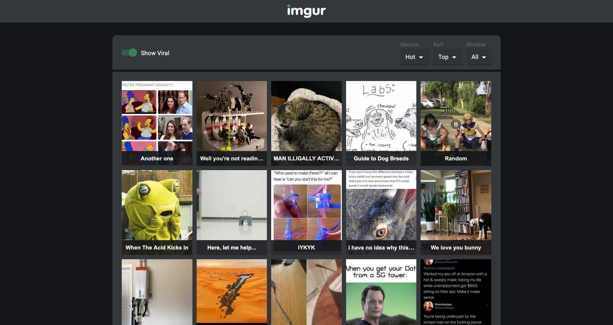
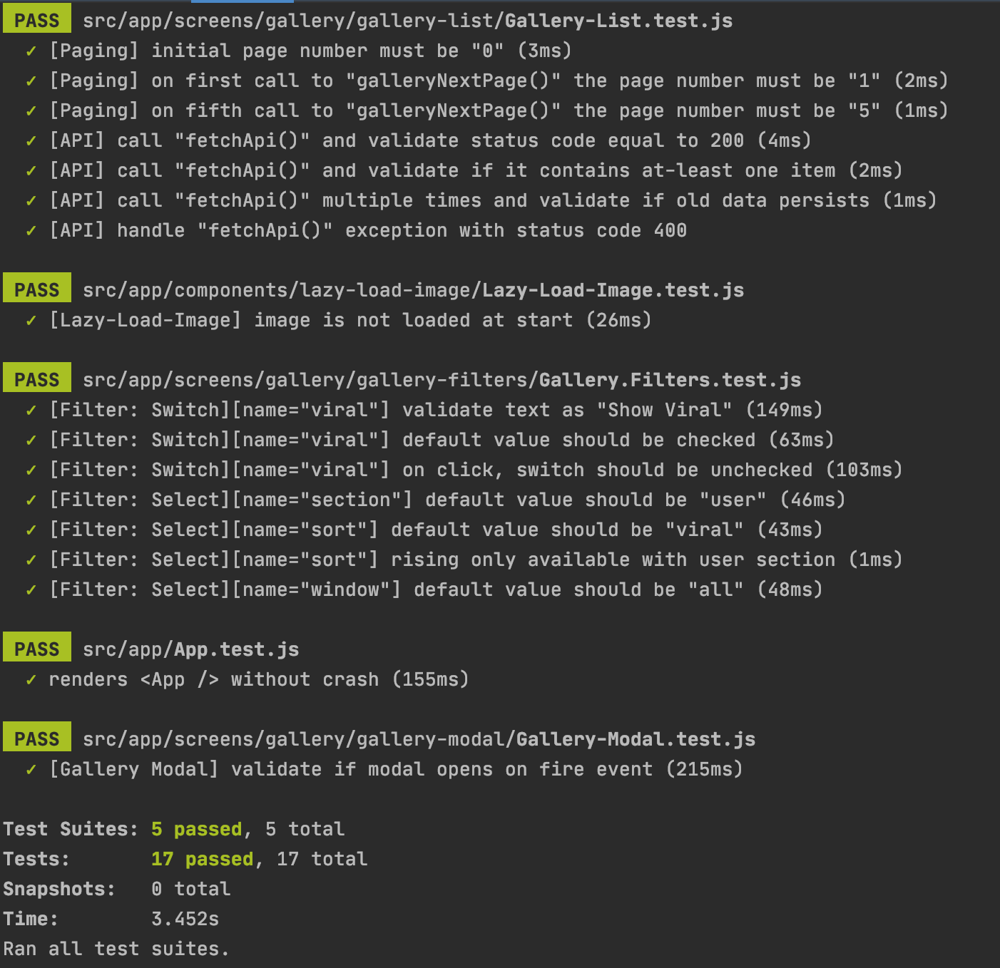

# Imgur Gallery
An Imgur based app that allows one to browse the Imgur gallery. The lazy-loading of images and infinite scrolling is implemented using the [Intersection Observer API](https://developer.mozilla.org/en-US/docs/Web/API/Intersection_Observer_API).

<p align="center">
	
</p>


## API: [official](https://apidocs.imgur.com/?version=latest#eff60e84-5781-4c12-926a-208dc4c7cc94)
```
https://api.imgur.com/3/gallery/{{section}}/{{sort}}/{{window}}/{{page}}?showViral={{showViral}}&album_previews={{albumPreviews}}
```

#### key / value
- section: hot | top | user
- sort: viral | top | time | rising (only available with user section) 
- page: integer
- window: day | week | month | year | all
    
#### Params
- showViral: Show or hide viral images from the user section. Defaults to true
- album_previews: Include image metadata for gallery posts which are albums


## Content
- [X] Show gallery images in a grid of thumbnails and lazy load them
- [X] Show image description in the thumbnail in bottom position
- [X] On clicking an image in the gallery, show its details: big image, title, description, up-votes, down-votes, and score
- [X] Filters:
    - [X] Filter the images based on: hot, top, user
    - [X] Include or exclude viral images from the result set
    - [X] Filter based on a window and sort parameters


## Unit Tests
<p align="left">
	
</p>


## Libraries and Frameworks

#### External 
- [X] [Create React App](https://github.com/facebook/create-react-app)
- [X] [Redux Toolkit](https://redux-toolkit.js.org/)
- [X] [Redux Devtools Extension](https://github.com/zalmoxisus/redux-devtools-extension)
- [X] [Material-UI](https://material-ui.com/)
- [X] [FontAwesome](https://fontawesome.com/)
- [X] [Jest Fetch Mock](https://github.com/jefflau/jest-fetch-mock/)


## Information
Check [React-Seed](https://github.com/imransilvake/React-Seed) to understand how to build and serve this project as well as how to use SCSS and JS linting.
